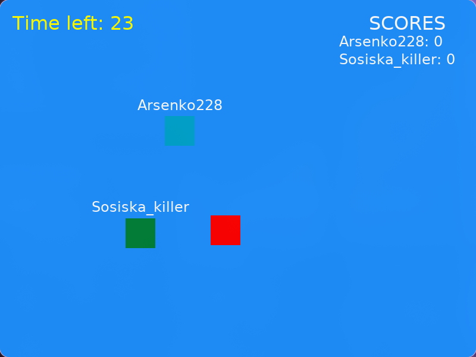

# Game on My VPS

A small two-player network game written in C. The dedicated server runs on a Linux machine or VPS, while each player runs the SDL2 client. Players compete to collect apples before the round ends.



## Features

- Dedicated UDP server and separate graphical client
- Two-player lobby with a short countdown before each round
- Real-time movement and shared player positions
- Apple collection and score tracking
- Reconnection support after a temporary client disconnect
- Linux build and installation support for common distributions

## Requirements

This release targets **Linux only**. You need:

- GCC or another C compiler compatible with the Makefile
- GNU Make
- SDL2
- SDL2_image
- SDL2_ttf
- A UDP port reachable by the clients, defaulting to `12345`

The included installer supports Debian/Ubuntu, Fedora/RHEL/CentOS, Arch/Manjaro/CachyOS, openSUSE, and Alpine Linux.

## Installation

Clone the repository and enter the project directory:

```bash
git clone <repository-url>
cd game-on-my-VPS
```

Install the native dependencies and create the initial configuration file:

```bash
./install.sh
```

The installer detects the Linux distribution, installs the SDL2 development packages, copies `config.example.h` to `config.h` when needed, and builds the client.

To build both binaries manually:

```bash
make
```

To remove the generated binaries:

```bash
make clean
```

## Configuration

Before building, edit `config.h` on both the server and client machines:

```c
#define SERVER_IP "203.0.113.10"
#define SERVER_PORT 12345
```

Use the server's public IP address for `SERVER_IP` when clients connect over the internet. The server listens on `SERVER_PORT` on all interfaces.

The main gameplay settings are also defined in `config.h`:

| Setting | Default | Description |
| --- | ---: | --- |
| `SERVER_PORT` | `12345` | UDP port used by the server and clients |
| `MAX_PLAYERS` | `2` | Maximum players in a session |
| `PLAYERS_TO_START` | `2` | Players required to start a round |
| `COUNTDOWN_SECONDS` | `5` | Lobby countdown before the round |
| `TIME_FOR_EXIT` | `30` | Round duration in seconds |
| `WINDOW_WIDTH` | `800` | Client window width |
| `WINDOW_HEIGHT` | `600` | Client window height |

`config.h` contains machine-specific settings and should not be committed to a public repository. Keep the shared values consistent between the server and every client, then rebuild.

## Running a local game

For a local two-player test, keep `SERVER_IP` set to `127.0.0.1`. Open separate terminals in the project directory.

Start the server:

```bash
./server
```

Start one client per player:

```bash
./client
```

Enter a nickname in each client and select **Join**. A round starts when both players are connected.

## Running on a VPS

1. Build and start `./server` on the VPS.
2. Allow inbound UDP traffic on the configured port in the VPS firewall and cloud provider security group. For the default configuration:

	```bash
	sudo ufw allow 12345/udp
	```

3. Copy the client build and assets to each player's Linux machine.
4. Set `SERVER_IP` in each client's `config.h` to the VPS public IP.
5. Rebuild the client with `make client` and run `./client`.

The server process must remain running while clients are playing. A process manager such as `systemd` or `tmux` can be used to keep it alive after disconnecting from the VPS.

## Controls

- **Arrow keys**: move the player
- **Enter**: submit the nickname or join the lobby when the nickname field is focused
- **Backspace**: edit the nickname
- **Close window**: leave the game

Collect the apple to increase your score. The player with the higher score when the timer reaches zero wins the round.

## Project layout

```text
.
├── client.c             # SDL2 client, menu, input, rendering, and networking
├── server.c             # UDP game server and session management
├── protocol.h           # Shared client/server message definitions
├── config.example.h     # Safe configuration template
├── install.sh           # Linux dependency installer and client build script
├── Makefile             # Build rules for server and client
├── assets/              # Runtime images and other game assets
└── fonts/               # Fonts used by the client
```

## Networking notes

The client and server exchange game messages over UDP. They must be built from compatible versions of `protocol.h` and `config.h`. The default implementation is intended for trusted environments; it does not provide encryption, authentication, or protection against malicious packets.

## Platform status

The current release supports Linux only. Windows and macOS builds are not provided or tested.
